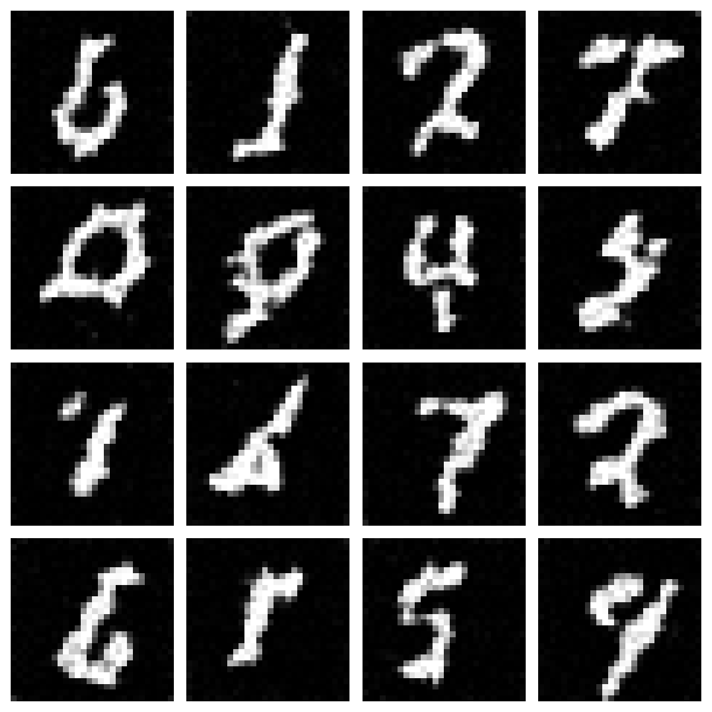
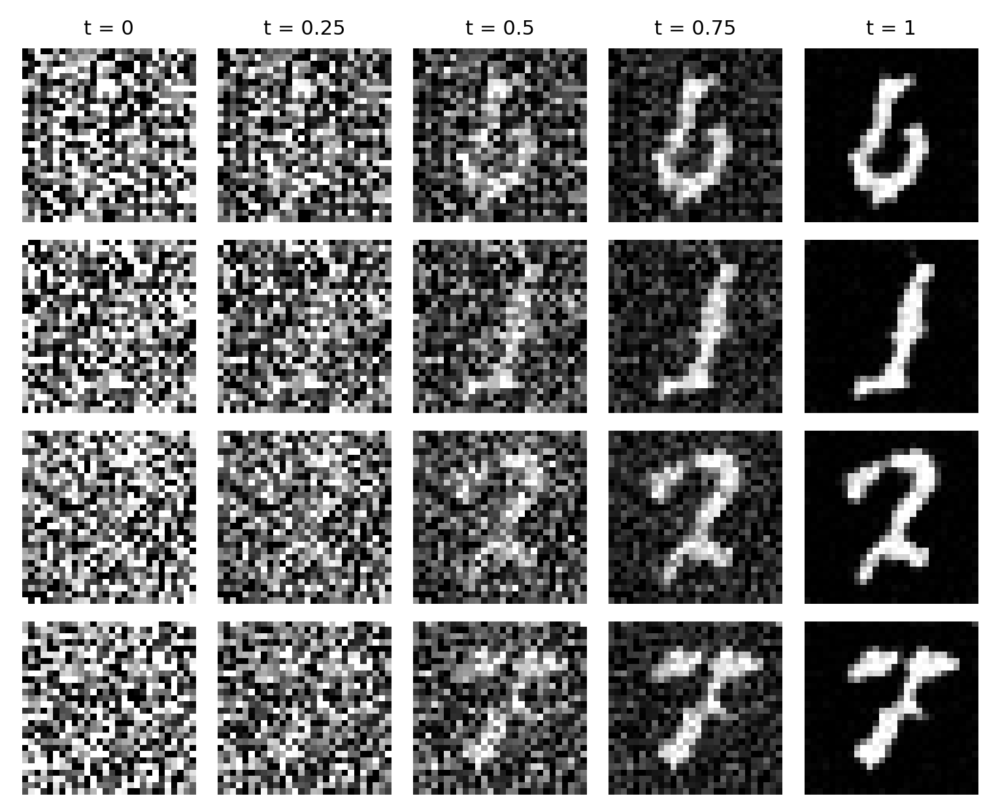

# Lecture 2 · MNIST Flow Matching

This lecture contains one Python script:
[flow_matching_unet_lecture.py](flow_matching_unet_lecture.py).
It covers MNIST downloading and data loading, a simple U-Net class, conditional
flow-matching training, and Euler sampling. Digit labels are ignored during
training, so generation is unconditional.

## Train and generate

After installing the [repository requirements](../requirements.txt), run this
command from the repository root:

```bash
python lecture_2/flow_matching_unet_lecture.py
```

The script downloads the 60,000-image MNIST training split into `data/`,
normalizes pixel values to the range [-1, 1], trains for 20 epochs, and saves
these files in `flow_matching_outputs/`:

| File | Contents |
| --- | --- |
| `flow_unet_mnist.pt` | Learned model weights, loss history, channel width, and training seed |
| `samples.png` | A grid of 16 generated images |
| `trajectory.png` | Four samples progressing from noise to images |

Paths are relative to the working directory. Change the constants in section 02
to adjust epochs, batch size, sampling steps, or output paths. CUDA, Apple MPS,
and CPU are selected automatically according to availability.

## Saved checkpoint

The bundled [flow_unet_mnist.pt](https://huggingface.co/ChatterjeeLab/CIS6270/resolve/main/lecture_2/flow_unet_mnist.pt?download=true)
was trained using the script's model, training function, and sampler.

| Setting | Saved run |
| --- | --- |
| Training data | All 60,000 MNIST training images |
| Completed epochs | 5 |
| Optimizer updates | 2,345 |
| Batch size | 128 |
| Optimizer | AdamW, learning rate 0.0002, weight decay 0 |
| U-Net widths | 32, 64, 128 channels |
| Trainable parameters | 471,265 |
| Training seed | 7 |
| Sampling | 100 forward Euler steps |

The saved run used CPU execution with PyTorch 2.14.0 and TorchVision 0.29.0.
The checkpoint contains `model`, `losses`, `base_channels`, `seed`, and
`epochs_completed`. It has five completed epochs; the script's default for a
new training run is twenty. Optimizer state is not included.

## Generate from the checkpoint

In Python or a notebook, with the repository root as the working directory:

```python
from pathlib import Path
import torch
from torchvision.utils import save_image
from lecture_2.flow_matching_unet_lecture import DEVICE, FlowUNet, sample_images

# Read the supplied weights and reconstruct the same U-Net.
checkpoint = torch.load(
    "lecture_2/flow_unet_mnist.pt", map_location="cpu", weights_only=True,
)
model = FlowUNet(base_channels=checkpoint["base_channels"]).to(DEVICE)
model.load_state_dict(checkpoint["model"])

# Generate new images directly from Gaussian noise.
torch.manual_seed(8)
samples, trajectory = sample_images(model, num_samples=16, steps=100)

# Convert the generated values to display pixels and save the results.
output = Path("flow_matching_outputs")
output.mkdir(exist_ok=True)
save_image(((samples.cpu() + 1) / 2).clamp(0, 1),
           output / "checkpoint_samples.png", nrow=4)
display_path = ((trajectory[:4] + 1) / 2).clamp(0, 1)
save_image(display_path.flatten(0, 1), output / "checkpoint_trajectory.png",
           nrow=trajectory.shape[1])
```

Importing the module does not start training or download MNIST. The images are
generated entirely from the saved weights and freshly sampled Gaussian noise.
Clipping occurs only when preparing the PNGs; intermediate ODE states remain
unclipped.

## Selected generated examples

These 16 images were manually selected from 512 outputs of the five-epoch
checkpoint. They illustrate the clearest generated digits in that batch.
The sampling example above generates a fresh, unselected batch.



The following trajectories show the first four selected images at times
0, 0.25, 0.5, 0.75, and 1:



## Script sections

| Sections | Lecture material |
| --- | --- |
| 01–03 | Imports, configuration, and MNIST data loading |
| 04 | Noise, interpolation time, intermediate image, and target velocity |
| 05–07 | Convolution blocks, the U-Net, and its forward pass |
| 08 | Loss, backpropagation, and optimizer updates |
| 09 | Sampling by integrating the learned velocity |
| 10–13 | Complete training run, checkpoint saving, and image export |

Continue with [Lecture 3](../lecture_3/README.md) for flow matching, diffusion,
and guidance using ESM-2 residue embeddings.
